<p align="center">
  <a href="https://locha.io/">
    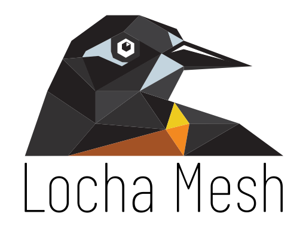
  </a>
  <br>
  <a href="https://github.com/btcven/locha-mesh-chat/actions">
    
  </a>
</p>
<p align="center">
  <a href="https://locha.io/">Project Website</a> |
  <a href="https://locha.io/donate">Donate</a> |
  <a href="https://github.com/sponsors/rdymac">Sponsor</a> |
  <a href="https://locha.io/buy">Buy</a>
</p>
<h1 align="center">Locha Mesh Chat</h1>
 

The first mobile application for the Locha Mesh. The aim is to build an app for communication using text messages, images, documents or voice notes, and also for broadcasting offline signed Bitcoin and other cryptocurrencies transactions.


## About Locha Mesh

The Locha Mesh is a radio network for off-grid messaging and cryptocurrency transactions without access to the internet. The main objective is a long range network for everyone, everywhere. For this reason we are working not only in a protocol, but also the firmware for affordable devices like the Turpial, Harpia, or their DIY equivalents. We adhere to open source ethos at every step and aim to make this tool as decentralized as possible so users can transmit with freedom.

If you want to learn more about Locha Mesh feel free to read the Locha Mesh [main repository](https://github.com/btcven/locha) or take a look at our website [locha.io](https://locha.io).


## Sponsor

If you want to support this project you can make a donation to the Locha Mesh
effort to build private censorship-resistant mesh network devices for cryptocurrency payments without Internet.

Here are some places if you want to support us:

- Donate: https://locha.io/donate
- Buy Turpial devices: https://locha.io/buy


## Development Workflow

The development code is located on the `dev` branch. All the development
happens there and all Pull-Requests should be pointed to that branch.
Make sure your Pull-Request follows the [CONTRIBUTING.md](CONTRIBUTING.md) guidelines.

## Screens

<div align="center">

 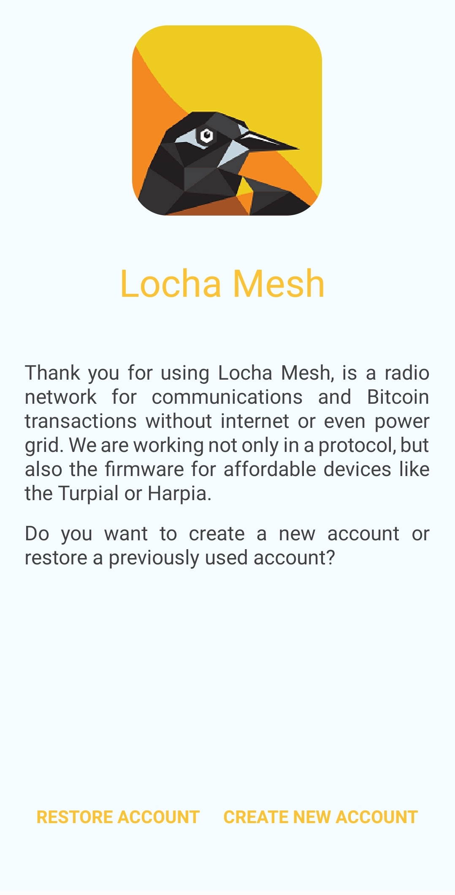
 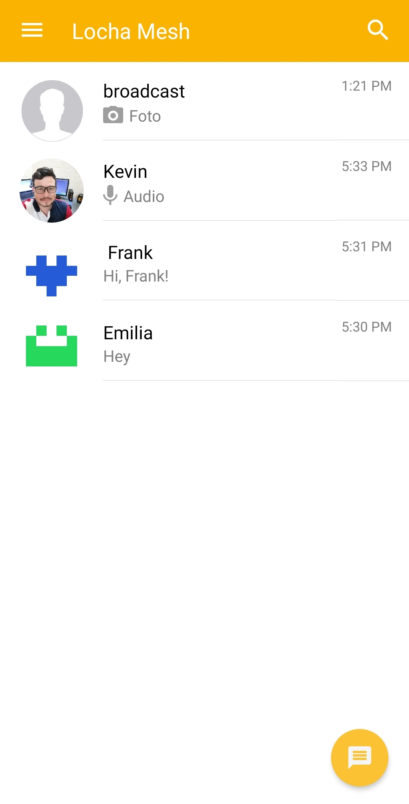
 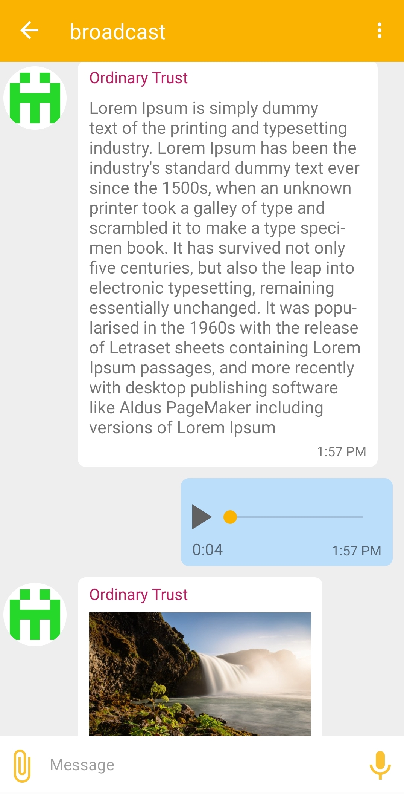
 
 
</div >

<div align="center">

 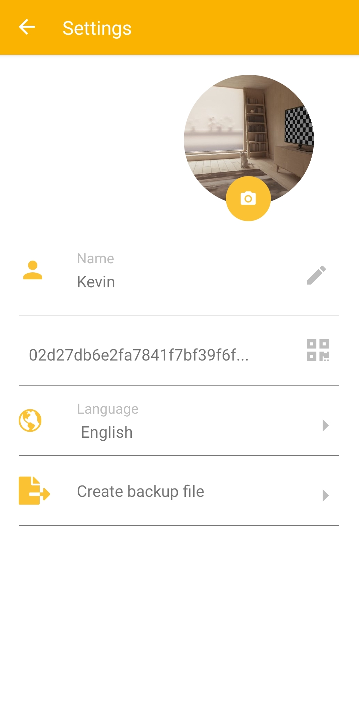
 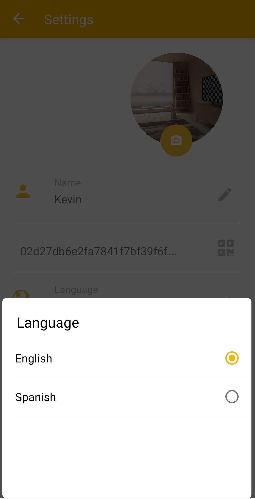
 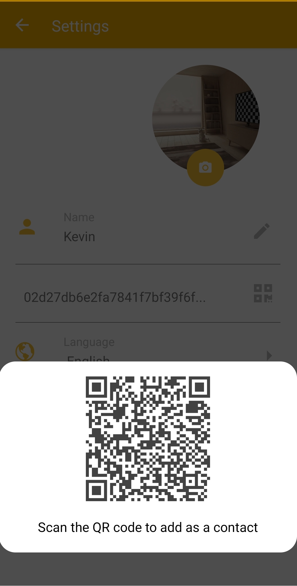
 

</div >

<div align="center">

 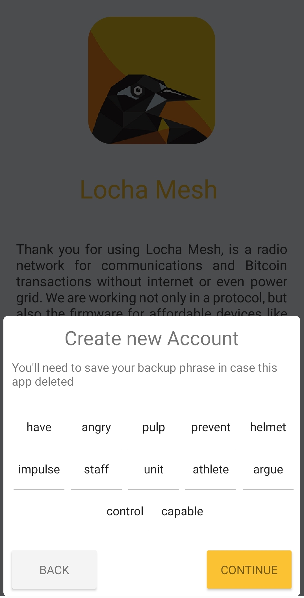
 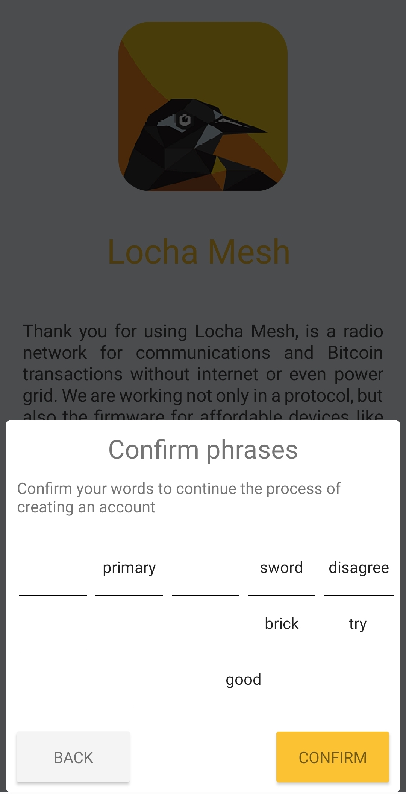
 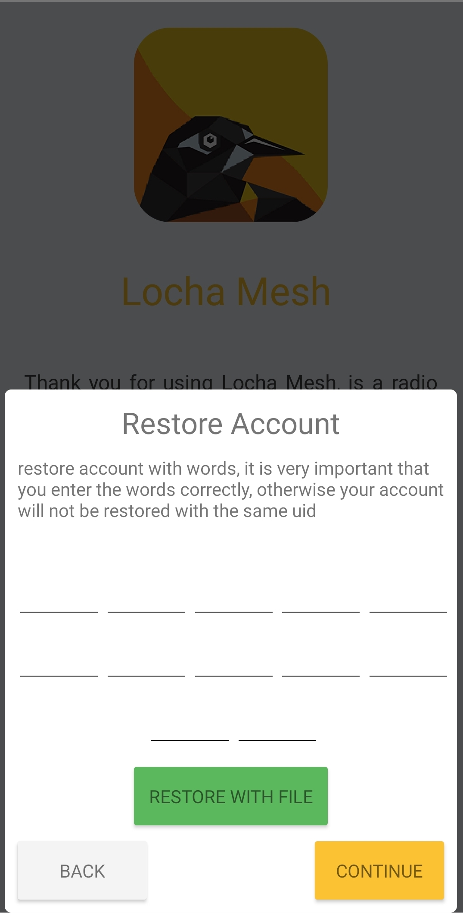
 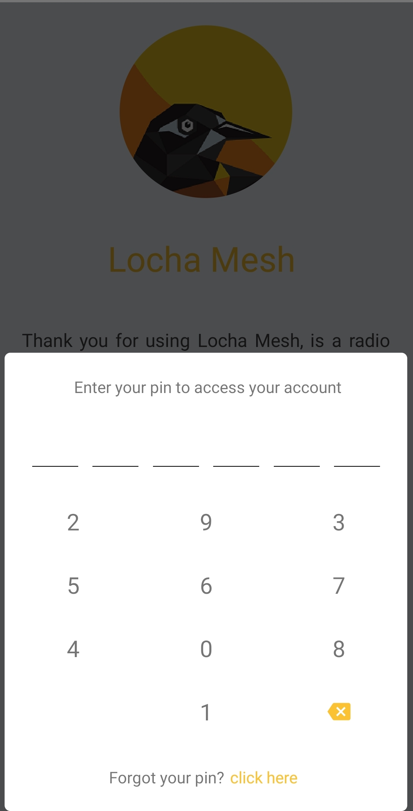
</div >
 

## Technologies
*The following are brief descriptions of the technologies used*

### [React-Native](https://facebook.github.io/react-native/)
*React Native enables you to build world-class application experiences on native platforms using a consistent developer experience based on JavaScript and React.*

It's a fantastic leap forward in providing the ability to write native applications with Javascript that target both iOS and Android. This application provides one code base that works on both platforms.  It demonstrates Form interactions,  Navigation, and use of many other components.

### [Redux](http://redux.js.org/)
*Redux is a predictable state container for JavaScript apps. It helps you write applications that behave consistently, run in different environments (client, server, and native), and are easy to test.*

Before Redux, application state was managed by all the various components in the app.  Now, the state is managed in a **predictable and consistent manner** and it can be **tested with Jest** and best of all, it is **independent** of the UI.  This is a major advancement in application design!

### [Realm](http://realm.io/)
Realm is a database engine designed to be used in the development of mobile applications for both Android and iOS systems. This system allows us to create relational databases in a simple way as well as being open source.

Realm Database is an alternative to SQLite and Core Data. Thanks to its zero-copy design, Realm Database is much faster than an ORM, and often faster than raw SQLite.

### [Native Base](http://nativebase.io/)
NativeBase is a sleek, ingenious and dynamic front-end framework created by passionate React Loving team at Geekyants to build cross platform Android & iOS mobile apps using ready to use generic components of React Native.

### [React Navigation](reactnavigation.org)
React Navigation is born from the React Native community's need for an extensible yet easy-to-use navigation solution written entirely in JavaScript (so you can read and understand all of the source), on top of powerful native primitives.

## Requirements
Before you start, make sure you have the following requirements

  - Node.js v10.x or a version less than 12.x
  - Java SE Development Kit (JDK 8)
  - Python 2.7
  - git
  - [Rust +1.45](https://rustup.rs/)
  - [cargo-ndk](https://github.com/bbqsrc/cargo-ndk)
  - Android Rust targets:
    - `rustup target add aarch64-linux-android armv7-linux-androideabi x86_64-linux-android i686-linux-android`
  - Android NDK

Check to have a dependency manager installed like [**npm**](https://) _(bundled with node)_ or [**yarn**](https://github.com/yarnpkg/yarn) _(recommended)_

## Short Summary

- The application runs on **both iOS and Android** with a **single code** base
- A user can  **Create* or **restore** account, modify their profile, add contacts and use chat with public channels and added contacts 
- The user can send text, audio and images in the chat
- Random names on public channels
- Supports multiple languages using I18n
- **All state changes*** are actions to the Redux store.
- **Every action** performed by the UI interfaces with the **Redux actions** and subsequently to the Redux Store.  This **reduces the complexity** of the JSX Components.


## Clone and Install

### Clone this repository 
```bash
git clone https://github.com/btcven/locha-mesh-chat.git
```

### Go into directory
```bash
cd locha-mesh-chat
```

### Install dependencies

With yarn

```bash
yarn install
```
or npm
```bash
npm install
```

### Equipment configuration

You need to configure your equipment to run this app, the process is different depending on your development system:
  
  * [macOS](documents/configuration/macOS.md)
  * Windows :construction_worker:
  * [Linux](documents/configuration/Linux.md)

In this link are the steps to follow the official [Documentation](https://facebook.github.io/react-native/docs/0.59/getting-started)

### Add native dependencies to the project

```
 react-native link

```

#### Open RNS in your iOS simulator

Run this command to start the development server and to start your app on iOS simulator:

```
react-native run-ios 

You can also open XCode and load project, Run product -> Run (⌘ + R)

```
Or, if you prefer Android:
```
 react-native run-android
```
For android verify that you have a device or emulator connected.

## License

Copyright (c) 2019 Bitcoin Venezuela and Locha Mesh developers.

Licensed under the **Apache License, Version 2.0**

---
**A text quote is shown below**

Unless required by applicable law or agreed to in writing, software
distributed under the License is distributed on an "AS IS" BASIS,
WITHOUT WARRANTIES OR CONDITIONS OF ANY KIND, either express or implied.
See the License for the specific language governing permissions and
limitations under the License.
___
Read the full text:
[Locha Mesh Apache License 2.0](https://github.com/btcven/LochaMesh-Chat/blob/master/LICENSE)
