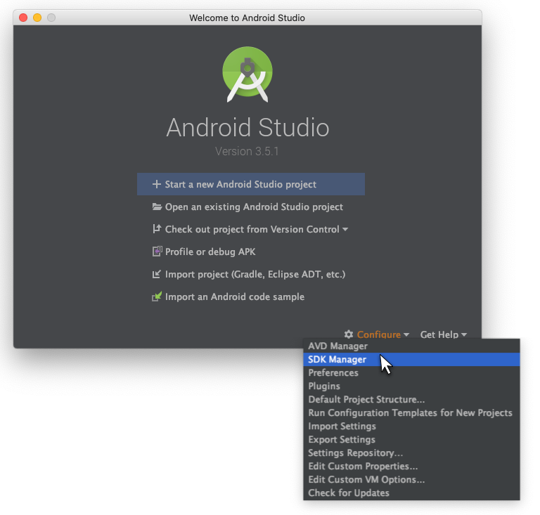
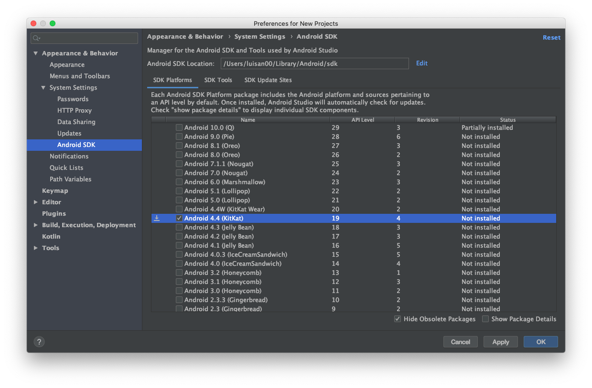

# Linux installation guide

## 1. Install dependencies

### Node.js

You will need  Node.js, follow the installation instructions for your Linux distribution [here](https://nodejs.org/en/download/package-manager)

Node.js comes with **npm**, if you want to use **yarn** install it following [this installation guide](https://yarnpkg.com/en/docs/install) from the yarn website.

### Java SE Development Kit (JDK 8)

If you want to use the JAVA SE, download it  from the [Oracle website](https://www.oracle.com/technetwork/java/javase/overview/index.html)

Or if you prefer to use OpenJDK, follow the installation guide for your Linux distribution [here](https://openjdk.java.net/install/index.html)


### The React Native CLI

Run the following command in a terminal

```bash
npm install -g react-native-cli
```

## 2. Android development environment

### Install Android Studio

Download and install [Android Studio](https://developer.android.com/studio/index.html), select a "custom" setup and make sure the next boxes are checked before to complete the instalation process:

- Android SDK
- Android SDK Platform
- Android Virtual Device

### Android SDK
The android sdk manager can be accessed via the Welcome window
- Click on `Configure` > `SDK Manager`



- Select the package for the platform that you want to install, Locha Mesh Chat is intended to be used on affordable mobile devices, and can be installed in Android KitKat 4.4, it also can be installed in the latest Android versions. 
In the tab SDK manager. e.g. select `Android 4.4 (KitKat)`-`API Level: 19` and click `Apply`. 
The SDK and related tools will be downloaded, when it finishes click `OK`.



### Configure the ANDROID_HOME environment variable

Add the following lines to your $HOME/.bash_profile or $HOME/.bashrc config file:
```bash
export ANDROID_HOME=$HOME/Android/Sdk
export PATH=$PATH:$ANDROID_HOME/emulator
export PATH=$PATH:$ANDROID_HOME/tools
export PATH=$PATH:$ANDROID_HOME/tools/bin
export PATH=$PATH:$ANDROID_HOME/platform-tools
```

## 3. Run Locha Mesh Chat application.

You can run the application in the android emulator or in your mobile phone.

### Use your mobile phone
You can use your physical device plugging it to your computer using a USB cable and following the [next steps](https://facebook.github.io/react-native/docs/next/running-on-device)

### Use a virtual device
If you don't have any virtual device yet you need to create almost one following the [next steps](https://developer.android.com/studio/run/managing-avds.html)

___

Now, inside the locha-mesh-chat folder we can run the application:

```bash
react-native run-android
```

That's all :wink:

___

Copyright (c) 2019 Bitcoin Venezuela and Locha Mesh developers.

Licensed under the **Apache License, Version 2.0**

**A text quote is shown below**

Unless required by applicable law or agreed to in writing, software
distributed under the License is distributed on an "AS IS" BASIS,
WITHOUT WARRANTIES OR CONDITIONS OF ANY KIND, either express or implied.
See the License for the specific language governing permissions and
limitations under the License.
___
Read the full text:
[Locha Mesh Apache License 2.0](https://github.com/btcven/LochaMesh-Chat/blob/master/LICENSE)