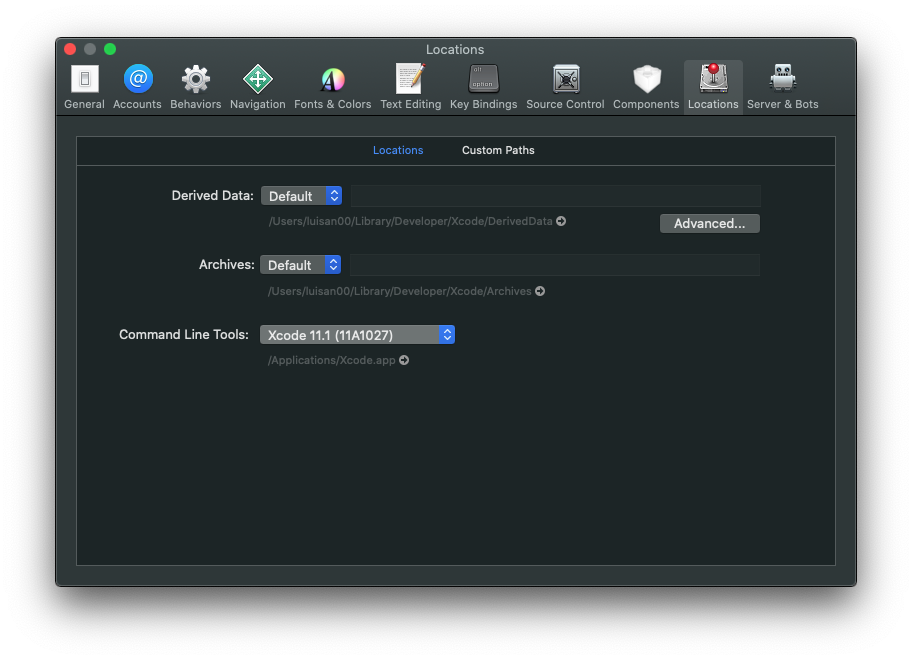

## Using macOS to compile Locha Mesh Chat for iOS devices
Before to proceed you need to install some tools, the easiest way is installing [**Xcode** via the Mac App Store](https://itunes.apple.com/us/app/xcode/id497799835?mt=12), this also will install the iOS simulator and other stuffs. If you have already installed **Xcode** on your computer, make sure it's version 9.4 or greater.

when you have installed Xcode run it and go to `Xcode` > `Preferences`, click on `Locations` in the Preferences window and select the most recent version available in the **Command Line Tools** dropdown.



### Run the Locha Mesh Chat application

You can run the application in the android emulator or in your mobile phone.

#### Use your mobile phone

If you want to run Locha Mesh Chat in your physical iOS device follow the [next guide](https://facebook.github.io/react-native/docs/next/running-on-device)

#### Use the iOS simulator

Inside the locha-mesh-chat folder we can run the application

```bash
react-native run-ios
```

That's all :wink:
